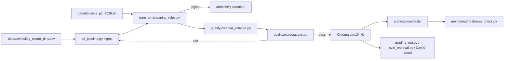

# Kiến trúc pipeline — Lab Day 10

**Tác giả:** Trương Đức  
**Cập nhật:** 2026-06-10 (Phase 1–3)

---

## 1. Sơ đồ luồng

**Điểm đo freshness (3 boundary):** `data_ingest`, `data_publish`, `pipeline_latency` — xem `freshness_boundaries` trong manifest.  
**run_id:** ghi trong log `artifacts/logs/run_<id>.log` và metadata Chroma.

---

## 2. Ranh giới module

| Thành phần | Input | Output | File |
|------------|-------|--------|------|
| Ingest | CSV raw 247 rows | `raw_records` log | `etl_pipeline.py` |
| Transform | Raw dict rows + canonical docs | `cleaned_*.csv`, `quarantine_*.csv` | `transform/cleaning_rules.py` |
| Pydantic | Cleaned rows | validate OK / halt | `quality/cleaned_schema.py` |
| Quality | Cleaned rows | expectation OK/FAIL, halt | `quality/expectations.py` |
| Embed | Cleaned CSV | Chroma upsert + prune | `etl_pipeline.py` |
| Monitor | Manifest JSON | PASS/WARN/FAIL freshness | `monitoring/freshness_check.py` |
| Eval | Chroma + questions | CSV / JSONL retrieval metrics | `eval_retrieval.py`, `grading_run.py` |

---

## 3. Idempotency & rerun

- Embed **upsert** theo `chunk_id` (hash doc_id + text + seq).
- Trước upsert: **prune** id không còn trong cleaned run (`embed_prune_removed` trong log).
- Rerun `python etl_pipeline.py run` 2 lần: collection size ổn định (~49 chunk sau merge canonical SLA), không phình vector.

---

## 4. Ghi chú vận hành

- HALT có kiểm soát: không embed khi expectation severity=halt (trừ `--skip-validate` cho demo).
- Quarantine giữ nguyên row gốc + `reason`; manifest ghi `quarantine_reason_counts`.
- Cleaning: sort `effective_date` desc trước dedupe; collapse token lặp ≥2 lần.
- Canonical SLA merge từ `data/docs/` thay vì append hack trong transform.
- Embed prefix `[P1|escalation]` + metadata Chroma (`priority_tier`, `sla_topic`, `chunk_text`).
- Eval/grading: doc-scope query theo `expect_top1_doc_id` + metadata re-rank (mặc định bật).
